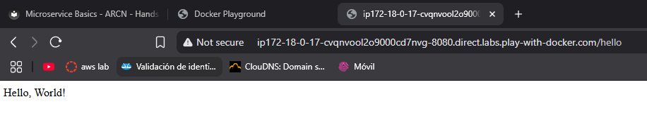

# Microservice ARCN

## 📖 ¿De qué trata el proyecto?

Este proyecto es un **microservicio** desarrollado con **Spring Boot**, diseñado para exponer un endpoint REST que devuelve un mensaje de saludo. Es un ejemplo práctico para aprender y demostrar cómo construir, probar y desplegar microservicios en Java. 

El objetivo principal es proporcionar una base sólida para proyectos más complejos, utilizando buenas prácticas de desarrollo y herramientas modernas.

---

## 🛠️ ¿Qué se requiere instalar?

Para ejecutar este proyecto, asegúrate de tener instaladas las siguientes herramientas:

- **Java 17** o superior: Para compilar y ejecutar el proyecto.
- **Maven**: Para gestionar dependencias y construir el proyecto (incluido el wrapper `mvnw`).
- **Docker** (opcional): Para ejecutar el proyecto en un contenedor.
- **Git** (opcional): Para clonar el repositorio.

---

## 🚀 ¿Cómo se ejecuta el proyecto en local?

Sigue estos pasos para ejecutar el proyecto en tu máquina local:

1. **Clona el repositorio**:
   ```bash
   git clone https://github.com/JffMv/Microservice_ARCN.git
   cd Microservice_ARCN
   ```

2. **Compila y construye el proyecto**:
   ```bash
   mvn clean install
   ```

3. **Ejecuta la aplicación**:
   ```bash
   mvn spring-boot:run
   ```

4. **Accede al endpoint**:
   Abre tu navegador o una herramienta como Postman y accede a:
   ```
   http://localhost:8080/hello
   ```

---

## 🏗️ ¿Qué arquitectura tiene?

El proyecto sigue una arquitectura **monolítica** básica, adecuada para microservicios simples. Está estructurado según el patrón **MVC (Model-View-Controller)** proporcionado por Spring Boot:

- **Controller**: Maneja las solicitudes HTTP y devuelve respuestas.

Esta arquitectura es ideal para proyectos pequeños y sirve como base para escalar hacia arquitecturas más complejas.

---

## 📂 ¿Qué estructura tiene el proyecto?

El proyecto sigue la estructura estándar de Maven y Spring Boot:

```
src/
├── main/
│   ├── java/
│   │   └── com.eci.arcn.microservice/
│   │       ├── MicroserviceApplication.java  # Clase principal
│   │       └── HelloWorldController.java     # Controlador REST
│   └── resources/
│       └── application.properties            # Configuración de la aplicación
├── test/
│   └── java/
│       └── com.eci.arcn.microservice/
│           └── MicroserviceApplicationTests.java  # Pruebas unitarias
```

---


## 🐳 ¿Cómo se puede dockerizar?

El proyecto incluye un archivo `Dockerfile` para crear una imagen Docker. Sigue estos pasos:

1. **Construye la imagen Docker**:
   ```
   docker build -t microservice-arcn .
   ```

2. **Ejecuta el contenedor**:
   ```
   docker run -p 8080:8080 microservice-arcn
   ```

3. **Accede al endpoint**:
   ```
   http://localhost:8080/hello
   ```

---

## ☁️ ¿Cómo se puede desplegar?

Este microservicio se despliega en docker http://labs.play-with-docker.com/ donde se descarga la imagen cargada en jeffer07/microservice-helloworld

por medio del comando
```
   docker run -p 8080:8080 <tu-usuario>/microservice-helloworld
```
### se abre la consula de play with docker

### se consume la imagen del repositorio de docker

---

## 🌟 Resultados de cómo se ve

Cuando accedes al endpoint `/hello`, obtendrás la siguiente respuesta en formato JSON:

```json
{
  "message": "Hello, World!"
}
```

---

## ✍️ Autor

**Yeferson Mesa**  
---
